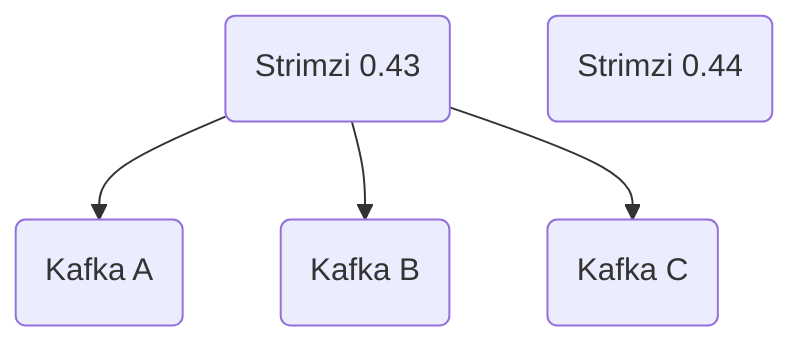
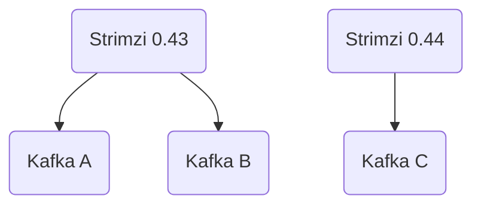
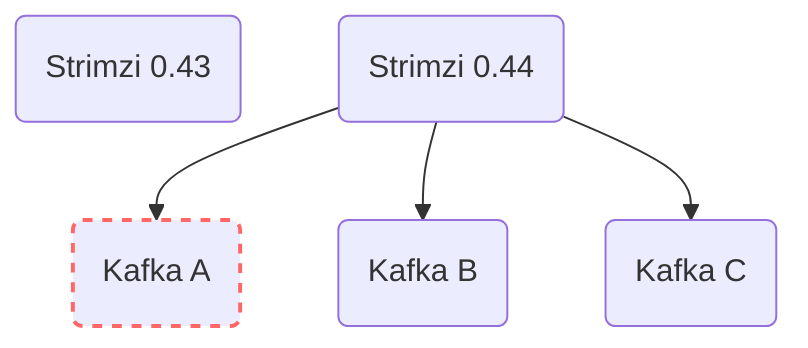
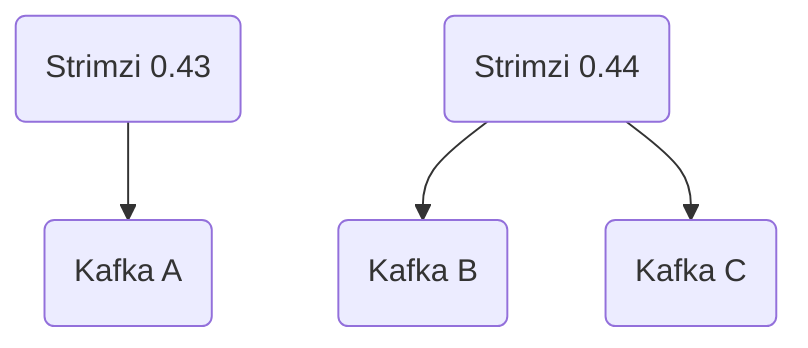
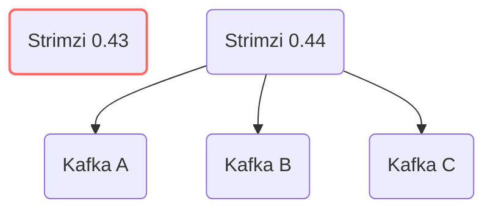
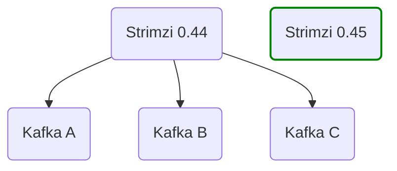

### Summary

When you upgrade an instance of the Strimzi Cluster Operator it causes **all** the Kafka clusters it manages to perform a rolling update. 
For large fleets this can be quite disruptive.
Ideally, you should be able to control which Kafka clusters upgrade to the new Strimzi version and when.

This post demonstrates how to perform phased Strimzi upgrades using  [kustomize](https://kubernetes.io/docs/tasks/manage-kubernetes-objects/kustomization/) to create a deployment that allows multiple Strimzi versions to run concurrently. 
The `STRIMZI_CUSTOM_RESOURCE_SELECTOR` environment variable allows us to specify which Strimzi instance manages which Kafka cluster via labels on the Kafka custom resources.

An [example repository](https://github.com/tomncooper/strimzi-phased-upgrade) shows the final setup and provides templates and scripts for adding new Strimzi versions.

This is a simplified example and comes with several key caveats that need to be considered when implementing a system like this:
- Strimzi Custom Resource Definitions (CRDs) are only guaranteed to be backwards compatible between adjacent versions. So, while it is possible to have more than two versions installed, you should aim to only have two adjacent Strimzi versions running at any one time.
- Changes in CRD API versions (`v1beta2` to `v1` for example) require all Kafka clusters to migrate to the new API version before a newer version of Strimzi is installed. 
- Special care needs to be taken when removing old Strimzi versions. The CRDs should be handled separately and great care should be taken when upgrading them. Removing the CRDs (even temporarily), rather than upgrading them, would cause all Strimzi managed Kafka clusters (and other operands) to be deleted.

### Contents

- [Background](#background)
   - [Custom Resource Definitions](#custom-resource-definitions)
   - [Strimzi Deployment](#strimzi-deployment)
- [Options for phased upgrades](#options-for-phased-upgrades)
   - [Strimzi per Namespace](#strimzi-per-namespace)
   - [Pause Reconciliation](#pause-reconciliation)
   - [Resource Selector](#resource-selector)
- [Resource Selector based upgrade](#resource-selector-based-upgrade)
   - [Concurrent Strimzi Deployments](#concurrent-strimzi-deployments)
      - [Custom Resource Definitions](#custom-resource-definitions-1)
      - [Strimzi install resources](#strimzi-install-resources)
      - [Deploying Strimzi with Kustomize](#deploying-strimzi-with-kustomize)
      - [Renaming Resources](#renaming-resources)
      - [Patching Environment Variables](#patching-environment-variables)
      - [Patching Role and ClusterRole Bindings](#patching-role-and-clusterrole-bindings)
      - [Watching all namespaces](#watching-all-namespaces)
      - [Operator Set](#operator-set)
   - [The Phased Upgrade Process](#the-phased-upgrade-process)
   - [Things to watch out for](#things-to-watch-out-for)
   - [Further deployment options](#further-deployment-options)
- [Conclusion](#conclusion)

### Background

Strimzi handles the [upgrade of Kafka clusters](https://strimzi.io/docs/operators/latest/deploying#proc-upgrade-kafka-kraft-str) for you, making it simple and easy for infrastructure teams to handle these complex operations. 
The [upgrade of the Strimzi operator](https://strimzi.io/docs/operators/latest/deploying#assembly-upgrade-cluster-operator-str) itself is also straight-forward. 
However, when you have a large fleet of Kafka clusters being managed by Strimzi, there are several elements you must keep in mind when performing the upgrade. 

#### Custom Resource Definitions 

The first step in a Strimzi operator upgrade is to update the [Custom Resource Definitions](https://kubernetes.io/docs/concepts/extend-kubernetes/api-extension/custom-resources/#customresourcedefinitions) (CRDs) for the Strimzi Custom Resources (CRs): `Kafka`, `KafkaTopic`, `KafkaUser` etc (we refer to these as the Strimzi operator's _operands_). 
The CRDs are Kubernetes cluster-wide resources and need to match the most recent version of Strimzi you have installed on the Kubernetes cluster. 
This is because new fields could have been added to the CRDs that the new Strimzi version expects to be there. 
Strimzi CRDs are backwards compatible (within the same API version -- see [this section](#custom-resource-definitions-1) for more details), so older Strimzi versions are ok with newer CRDs (they will ignore the new fields) but not the other way around.

#### Strimzi Deployment

Once the CRDs are updated, you then need to [upgrade the Strimzi Operator](https://strimzi.io/docs/operators/latest/deploying#assembly-upgrade-cluster-operator-str) itself. 
This requires you to update the [Deployment resource](https://github.com/strimzi/strimzi-kafka-operator/blob/main/install/cluster-operator/060-Deployment-strimzi-cluster-operator.yaml) (and any additional RBAC or other resources the new version needs). 
This will in-turn change the `key=value` maps, in the Deployment's container template environment variables, which control the default image assignments for each of the operands that Strimzi manages (Kafka, Kafka Connect etc.):

```yaml
apiVersion: apps/v1
kind: Deployment
spec:
  template:
    spec:
      containers:
        - name: strimzi-cluster-operator
          ...
          env:
          ...
          - name: STRIMZI_KAFKA_IMAGES
            value: |
              3.8.0=quay.io/strimzi/kafka:0.45.0-kafka-3.8.0
              3.8.1=quay.io/strimzi/kafka:0.45.0-kafka-3.8.1
              3.9.0=quay.io/strimzi/kafka:0.45.0-kafka-3.9.0
          - name: STRIMZI_KAFKA_CONNECT_IMAGES
            value: |
              3.8.0=quay.io/strimzi/kafka:0.45.0-kafka-3.8.0
              3.8.1=quay.io/strimzi/kafka:0.45.0-kafka-3.8.1
              3.9.0=quay.io/strimzi/kafka:0.45.0-kafka-3.9.0
          - name: STRIMZI_KAFKA_MIRROR_MAKER_IMAGES
            value: |
              3.8.0=quay.io/strimzi/kafka:0.45.0-kafka-3.8.0
              3.8.1=quay.io/strimzi/kafka:0.45.0-kafka-3.8.1
              3.9.0=quay.io/strimzi/kafka:0.45.0-kafka-3.9.0
          - name: STRIMZI_KAFKA_MIRROR_MAKER_2_IMAGES
            value: |
              3.8.0=quay.io/strimzi/kafka:0.45.0-kafka-3.8.0
              3.8.1=quay.io/strimzi/kafka:0.45.0-kafka-3.8.1
              3.9.0=quay.io/strimzi/kafka:0.45.0-kafka-3.9.0
        ...
```

In the sample above you can see that the Kafka version maps to an image which contains the Strimzi version. 
The container images used by Strimzi include scripts, health endpoint servers and other services which form an API for the container.
A given version of Strimzi expects certain endpoints, scripts etc to be present on the container in order to perform its operations. 
This is why, even if the Kafka version has not changed, the image must change when you upgrade Strimzi.

The result of this is that when you upgrade the Cluster Operator it will, as part of the reconciliation, change the image value on **all** of the Kafka broker pods in all of the Kafka clusters managed by that Strimzi instance on the Kubernetes cluster. 
This means that all of your Kafka fleet (managed by that operator instance) will need to roll. 
Strimzi will do this one broker at time and maintain topic availability (provided your topics have a replication factor greater than 1).
However, rolling every Kafka cluster in your fleet could be quite disruptive.

So what can we do to add more control?

### Options for phased upgrades

What we need is a way to control which Kafka clusters get upgraded and in what order. 
This is often referred to as a phased upgrade or as an upgrade with _"blast radius"_ control because we can limit the application of the upgrade to a small number of resources (the radius) and contain any potential negative effects (the blast).

There are several possible ways to implement phased upgrades of the Kafka clusters managed by a Strimzi operator:

#### Strimzi per Namespace

The first option is to install a Strimzi Cluster Operator in every namespace where Kafka clusters are running. 
This way you could upgrade the Cluster Operator Deployment one namespace at a time and have blast radius control (limited to each namespace) and could, if you encounter an issue, roll back a particular Operator upgrade.

However, if you have multiple Kafka clusters in a namespace you would still roll all of them automatically. 
More critically, as a single Strimzi instance is capable of running multiple Kafka clusters, this is a very inefficient deployment model with potentially many Strimzi instances running idle. 

The Cluster Operators would also all share the cluster-wide CRDs and so care and time would need to be taken to update these and upgrade all the Operators in a timely fashion.

#### Pause Reconciliation

If you have a Strimzi Cluster Operator managing multiple Kafka clusters, either across a whole Kubernetes cluster or in a namespace, then another option is to temporarily stop the Operator from managing a given Kafka cluster (or other operand) until the upgrade is complete.

To do this you would need to:
1. Apply the [pause reconciliation annotation](https://strimzi.io/docs/operators/latest/deploying#proc-pausing-reconciliation-str) to all Kafka CRs (and other operands like Kafka Connect deployments).
2. Upgrade the CRDs and the Strimzi Operator Deployment to the new version.
3. In the order you want, remove the annotation from each Kafka CR. The operator will resume reconciliation, update the image reference and roll the Kafka cluster.

While this process does give you blast radius control, it does have several drawbacks:
- You need to annotate _everything_ you don't want to automatically update.
- Until a specific Kafka resource is finally upgraded, that resource is _unmanaged_. Strimzi will not reconcile it, fix any issues or perform any admin operations.
- Roll back is an _all or nothing_ operation. If you encounter an issue you would need to pause _all_ Kafka resources again, downgrade the Strimzi Operator and then un-pause the resources.   

#### Resource Selector

While these options for phased upgrades work in theory, in practice they have several drawbacks which make them unsuitable for production deployments. 
A more effective approach involves using the _Custom Resource Selector_. 
This is an [environment variable](https://strimzi.io/docs/operators/latest/deploying#ref-operator-cluster-str) that is set in the Cluster Operator deployment:

>`STRIMZI_CUSTOM_RESOURCE_SELECTOR` 
   Optional. The label selector to filter the custom resources handled by the Cluster Operator. The operator will operate only on those custom resources that have the specified labels set. Resources without these labels will not be seen by the operator. The label selector applies to `Kafka`, `KafkaConnect`, `KafkaBridge`, `KafkaMirrorMaker`, and `KafkaMirrorMaker2` resources. `KafkaRebalance` and `KafkaConnector` resources are operated only when their corresponding Kafka and Kafka Connect clusters have the matching labels.  
> ```yaml 
> env:   
> 	- name: STRIMZI_CUSTOM_RESOURCE_SELECTOR     
> 	  value: label1=value1,label2=value2 
> ```

Using this selector, you can set a label (`strimzi-0-43-0` for example) in a given Strimzi Deployment and then tag some or all of the Kafka CRs (and other operands) with this label and that Strimzi deployment will manage them and only them. 
Any operand CRs without the label will be ignored. 

You could then deploy _another_ cluster-scoped Strimzi operator with a different custom resource selector, `strimzi-0-43-0-b` for example, and tag a different set of Operand CRs with that label.
The two Strimzi deployments would coexist happily (provided you have setup independent RBAC -- more on this later), managing completely separate sets of CRs.

This features allows us to define a more robust upgrade process for the Strimzi Operator and its operands.

### Resource Selector based upgrade

Using the Custom Resource Selector allows us to have fine grained control over which operands are upgraded to new Strimzi versions and when. 
However, in order to use this process we need to deploy multiple versions of Strimzi concurrently.
That requires us to consider several key aspects of the Strimzi installation resources:

#### Concurrent Strimzi Deployments

##### Custom Resource Definitions

The first major consideration when designing a deployment strategy for multiple Strimzi versions is the CRDs. 
As discussed, these are backwards compatible between Strimzi versions but not forwards compatible.
Older Strimzi operands can use newer CRDs but not the other way around.
This means that, for concurrent Strimzi deployments, we need to make sure that only the most recent version of the CRDs is installed in the Kubernetes cluster.
We will cover how to separate out the CRDs from the installation files in the sections below. 
However, first we need to cover some important considerations regarding the CRDs and multiple Strimzi versions.

###### Supported concurrent versions

As with any Kubernetes resource, Strimzi CRDs have an API version, which is currently [`v1beta2`](https://github.com/strimzi/strimzi-kafka-operator/blob/ac5f9b48db851737aba12abebee4000295d2ec1c/install/cluster-operator/040-Crd-kafka.yaml#L23).
Theoretically, Strimzi operands that share this API version can coexist and you _could_ run multiple versions concurrently on the same Kubernetes cluster (0.43. 0.44 ad 0.45 for example).
However, the only guaranteed and tested configuration is two adjacent Strimzi versions.
This has to be supported to allow the upgrade of a single Strimzi instance and so is tested as part of a Strimzi release. 
If you install more than two adjacent Strimzi versions, you are running the risk of newer CRDs causing issues for older operands. 
For example, operands managed by Strimzi 0.43 may fail if 0.45 CRDs are installed, as this is an unsupported and untested configuration.
Therefore, it is strongly recommended that you only run two adjacent Strimzi versions using a system like the one proposed in this post.

###### CRD API version upgrades

The next consideration is when the CRD API version is upgraded.
For example when Strimzi eventually upgrades from `v1beta2` to `v1` CRDs.
When this occurs you will need to first make sure **all** operands are updated to the latest Strimzi version running the old CRD API version (e.g. `v1beta1`).
You will need to do this **before** you install the CRDs for the new Strimzi version which uses the new CRD API version (e.g. `v1`).
You would then follow any specific upgrade instructions and move each operand onto the new Strimzi version and CRD API version.

Using the last CRD API version upgrade as an example, we can illustrate the process. 
Strimzi 0.21 supports the older `v1beta1` API version, Strimzi 0.22 supports both the older `v1beta1` as well as the newer `v1beta2` and finally, Strimzi 0.23 supports only the new `v1beta2` CRDs. 
Because of this, we can run Strimzi 0.21 and 0.22 concurrently as both support the older `v1beta1` API. 
We can also run Strimzi 0.22 and 0.23 concurrently, as both support the newer `v1beta2` API. 
However, we cannot run Strimzi 0.21 and 0.23 concurrently, as each supports a different API version.

So, if we were running a setup with Strimzi 0.21 and wanted to upgrade to 0.23, we have to:

- First install CRDs from Strimzi 0.22 with both `v1beta1` and `v1beta2` API versions and install the Stirmzi 0.22 deployment, RBAC resources, etc.
- Migrate all operands from 0.21 to 0.22.
- Remove the 0.21 operator.
- Perform the specific [CRD upgrade instructions](https://strimzi.io/docs/operators/0.23.0/deploying#assembly-upgrade-resources-str), install CRDs from Strimzi 0.23 with only the `v1beta2` API versions and install the Stirmzi 0.23 deployment, RBAC resources, etc.
- Migrate all operands from 0.22 to 0.23.
- Remove the 0.22 operator.

##### Strimzi install resources

With the above considerations around CRDs in mind, lets move on to how to handle the rest of the Strimzi installation resources when installing multiple concurrent Strimzi versions.

A standard Strimzi deployment includes the service accounts and RBAC resources it requires, such as `Role`, `ClusterRole`, and their associated bindings. 
By default these are all named `strimzi-cluster-operator` or similar.
If we try and deploy multiple operator instances in the same namespace, or over multiple namespaces that share `ClusterRole` resources and bindings, things can get messy.
Also, different Strimzi versions may need different permissions and so we need to make sure independent copies of these RBAC resources are deployed for each Strimzi version.

##### Deploying Strimzi with Kustomize

There are many ways to template Kubernetes deployments.
Helm is a common option, and the Operator Lifecycle Manager (OLM) is often used for operators. 
In this example, we use [kustomize](https://kubernetes.io/docs/tasks/manage-kubernetes-objects/kustomization/), which is built into `kubectl`.
This gives us a way to take a base set of resources, in this case the Strimzi installation resources, and alter them using patches defined in a `kustomization.yaml` file.

Within the `kustomization.yaml` you define the resources you want kustomize to act on.
Any folder which itself contains a `kustomization.yaml` file can be imported into one at a higher level.
In this way you can define patches at each folder level and then pull all the folders into one kustomization deployment at a higher level.

This will be easier to understand with an example.
In order to have multiple concurrent Strimzi versions, the first thing we need to do is separate out the CRDs, so we can always have the most recent ones installed.
The folder structure shown below illustrates how to use kustomize to take the standard [Strimzi installation resource files](https://github.com/strimzi/strimzi-kafka-operator/tree/release-0.43.x/install) and separate out the CRDs:

```shell
install-files
├── cluster-operator-0.43.0
│  ├── 010-ServiceAccount-strimzi-cluster-operator.yaml
│  ├── 020-ClusterRole-strimzi-cluster-operator-role.yaml
│  ├── 020-RoleBinding-strimzi-cluster-operator.yaml
│  ├── 021-ClusterRole-strimzi-cluster-operator-role.yaml
│  ├── 021-ClusterRoleBinding-strimzi-cluster-operator.yaml
│  ├── 022-ClusterRole-strimzi-cluster-operator-role.yaml
│  ├── 022-RoleBinding-strimzi-cluster-operator.yaml
│  ├── 023-ClusterRole-strimzi-cluster-operator-role.yaml
│  ├── 023-RoleBinding-strimzi-cluster-operator.yaml
│  ├── 030-ClusterRole-strimzi-kafka-broker.yaml
│  ├── 030-ClusterRoleBinding-strimzi-cluster-operator-kafka-broker-delegation.yaml
│  ├── 031-ClusterRole-strimzi-entity-operator.yaml
│  ├── 031-RoleBinding-strimzi-cluster-operator-entity-operator-delegation.yaml
│  ├── 033-ClusterRole-strimzi-kafka-client.yaml
│  ├── 033-ClusterRoleBinding-strimzi-cluster-operator-kafka-client-delegation.yaml
│  ├── 050-ConfigMap-strimzi-cluster-operator.yaml
│  ├── 060-Deployment-strimzi-cluster-operator.yaml
│  ├── kustomization.yaml
├── crds
│  ├── 04A-Crd-kafkanodepool.yaml
│  ├── 040-Crd-kafka.yaml
│  ├── 041-Crd-kafkaconnect.yaml
│  ├── 042-Crd-strimzipodset.yaml
│  ├── 043-Crd-kafkatopic.yaml
│  ├── 044-Crd-kafkauser.yaml
│  ├── 045-Crd-kafkamirrormaker.yaml
│  ├── 046-Crd-kafkabridge.yaml
│  ├── 047-Crd-kafkaconnector.yaml
│  ├── 048-Crd-kafkamirrormaker2.yaml
│  ├── 049-Crd-kafkarebalance.yaml
│  └── kustomization.yaml
└── kustomization.yaml
```

Contents of `install-files/cluster-operator-0.43.0/kustomization.yaml`
```yaml
resources:
- 010-ServiceAccount-strimzi-cluster-operator.yaml
- 020-ClusterRole-strimzi-cluster-operator-role.yaml
- 020-RoleBinding-strimzi-cluster-operator.yaml
- 021-ClusterRoleBinding-strimzi-cluster-operator.yaml
- 021-ClusterRole-strimzi-cluster-operator-role.yaml
- 022-ClusterRole-strimzi-cluster-operator-role.yaml
- 022-RoleBinding-strimzi-cluster-operator.yaml
- 023-ClusterRole-strimzi-cluster-operator-role.yaml
- 023-RoleBinding-strimzi-cluster-operator.yaml
- 030-ClusterRoleBinding-strimzi-cluster-operator-kafka-broker-delegation.yaml
- 030-ClusterRole-strimzi-kafka-broker.yaml
- 031-ClusterRole-strimzi-entity-operator.yaml
- 031-RoleBinding-strimzi-cluster-operator-entity-operator-delegation.yaml
- 033-ClusterRoleBinding-strimzi-cluster-operator-kafka-client-delegation.yaml
- 033-ClusterRole-strimzi-kafka-client.yaml
- 050-ConfigMap-strimzi-cluster-operator.yaml
- 060-Deployment-strimzi-cluster-operator.yaml
``` 

Contents of `install-files/crds/kustomization.yaml`
```yaml
resources:
- 040-Crd-kafka.yaml
- 041-Crd-kafkaconnect.yaml
- 042-Crd-strimzipodset.yaml
- 043-Crd-kafkatopic.yaml
- 044-Crd-kafkauser.yaml
- 045-Crd-kafkamirrormaker.yaml
- 046-Crd-kafkabridge.yaml
- 047-Crd-kafkaconnector.yaml
- 048-Crd-kafkamirrormaker2.yaml
- 049-Crd-kafkarebalance.yaml
- 04A-Crd-kafkanodepool.yaml
```

Contents of `install-files/crds/kustomization.yaml`
```yaml
resources:
- cluster-operator-0.43.0
- crds
```

Using the setup above we can deploy the Strimzi 0.43 operator using the single command:

```shell
kubectl -n <strimzi namespace> apply -k install-files
```

This will tell `kubectl` to look in the `install-files` directory for a `kustomization.yaml` file and import whatever resources and patches it finds there. 
This in-turn cascades through each of the folders defined in that top level kustomization and runs those imports and patches and so on.

If you want to see the output sent to Kubernetes you can preview it by running:

```shell
kubectl kustomize install-files
```

This will render the kustomize altered install resources to the console.

##### Renaming Resources

With one Strimzi version deployed, the next step is to add another to allow for the phased upgrade.
As discussed above however, we need to rename the RBAC and configuration resources so each version has its own set. 
Kustomize makes this easy using the `nameSuffix` patch. 
This adds the supplied string to the name of every resource in the `resources` list defined in that `kustomization.yaml` file. 
It also updates any references to those renamed resources.
For example this will change the name of the Strimzi configuration `ConfigMap` resource and also the reference to it in the Strimzi Cluster Operator `Deployment` resource.

To make this change we simply add one line to the `kustomization.yaml` in each Strimzi version directory:

`install-files/cluster-operator-0.43.0/kustomization.yaml`
```yaml
resources:
- 010-ServiceAccount-strimzi-cluster-operator.yaml
...
- 060-Deployment-strimzi-cluster-operator.yaml

nameSuffix: '-0-43-0'
```

That's it. 
You can see how it changes the names by building the kustomization with:
```shell
kubectl kustomize install-files
```

We can now add a newer Strimzi version by downloading the install files for that version, moving the CRDs to the separate `crds` folder (replacing the older ones) and then adding a `kustomization.yaml` to that version's folder with a different `nameSuffix`:

`install-files/cluster-operator-0.44.0/kustomization.yaml`
```yaml
resources:
- 010-ServiceAccount-strimzi-cluster-operator.yaml
...
- 060-Deployment-strimzi-cluster-operator.yaml

nameSuffix: '-0-44-0'
```

##### Patching Environment Variables

While the `nameSuffix` handles a significant part of the process, additional changes are needed.
There are several other elements of the deployment files that need to be customised in order to allow the Strimzi versions to exist concurrently.

The first of these are the environment variables in the Strimzi operator `Deployment` resource, several of which need to be tailored to each Strimzi version. 
The Custom Resource Selector env var value must be specific to each Strimzi version so that each operator instance knows which label to look for on the operand CRs.
We also need to update the env var which controls the name of the lease for Strimzi's high availability mode. 

We can patch the env vars in the Strimzi cluster operator `Deployment` CR using kustomize.
To do this we create a yaml file containing the entries we would like to change or add.
We then tell kustomize to merge this patch yaml with the operator's `Deployment` resource:

Contents of `install-files/cluster-operator-0.43.0/patches/patch-deployment.yaml`
```yaml
apiVersion: apps/v1
kind: Deployment
metadata:
  name: strimzi-cluster-operator
spec:
  template:
    spec:
      containers:
        - name: strimzi-cluster-operator
          env:
            - name: STRIMZI_CUSTOM_RESOURCE_SELECTOR
              value: strimzi-resource-selector=strimzi-0-43-0
            - name: STRIMZI_LEADER_ELECTION_LEASE_NAME
              value: "strimzi-cluster-operator-0-43-0"
```

Contents of `install-files/cluster-operator-0.43.0/kustomization.yaml`
```yaml
resources:
- 010-ServiceAccount-strimzi-cluster-operator.yaml
...
- 060-Deployment-strimzi-cluster-operator.yaml

nameSuffix: '-0-43-0'

patches:
  - path: patches/patch-deployment.yaml
    target:
      kind: Deployment
      name: strimzi-cluster-operator
```

##### Patching Role and ClusterRole Bindings

The `RoleBinding` and `ClusterRoleBinding` resources used by the operator also need to be tailored for each Strimzi version.
Again we can apply a patch to these in the `kustomization.yaml`:

Contents of `install-files/cluster-operator-0.43.0/patches/patch-role-references.yaml`
```yaml
- op: replace
  path: /subjects/0/name
  value: strimzi-cluster-operator-0-43-0
- op: replace
  path: /subjects/0/namespace
  value: strimzi
```

Contents of `install-files/cluster-operator-0.43.0/kustomization.yaml`
```yaml
resources:
- 010-ServiceAccount-strimzi-cluster-operator.yaml
...
- 060-Deployment-strimzi-cluster-operator.yaml

nameSuffix: '-0-43-0'

patches:
  ...
  - path: patches/patch-role-references.yaml
    target:
      kind: (RoleBinding|ClusterRoleBinding)
      name: ".*"
```

This patch updates all `RoleBinding` and `ClusterRoleBinding` resources in the resources list. 
It replaces the name of the first entry in the subjects list (which is the operator’s `ServiceAccount` in the base installation files) with the name specified in the patch.
This name should be the original name in the base Strimzi  operator `ServiceAccount` plus the `nameSuffix`.
It will also patch the `namespace` which should match the namespace where the service account is installed. 
In this case we assume all operator versions are installed in the `strimzi` namespace.

##### Watching all namespaces

The final thing we need to setup is configuring the namespaces that the Strimzi Operators will watch.
For this example we assume that the various Strimzi versions will be watching all namespaces on the Kubernetes cluster.
As per [the documentation](https://strimzi.io/docs/operators/latest/deploying#deploying-cluster-operator-to-watch-whole-cluster-str) we need to alter the `RoleBinding` and `ClusterRoleBinding` namespaces to match the one the operator is installed in.
However, that is already handled by the step above.

We then need to set the `STRIMZI_NAMESPACE` env var in the operator `Deployment` to `*`.
For this we can update the `patch-deployment.yaml` from the earlier step:

Contents of `install-files/cluster-operator-0.43.0/patches/patch-deployment.yaml`
```yaml
apiVersion: apps/v1
kind: Deployment
metadata:
  name: strimzi-cluster-operator
spec:
  template:
    spec:
      containers:
        - name: strimzi-cluster-operator
          env:
            - name: STRIMZI_NAMESPACE
              value: "*" 
              valueFrom: null
            - name: STRIMZI_CUSTOM_RESOURCE_SELECTOR
              value: strimzi-resource-selector=strimzi-0-43-0
            - name: STRIMZI_LEADER_ELECTION_LEASE_NAME
              value: "strimzi-cluster-operator-0-43-0"
```

[The documentation](https://strimzi.io/docs/operators/latest/deploying#deploying-cluster-operator-to-watch-whole-cluster-str) then says we need to create several additional `ClusterRoleBindings`. 
We can add these to the base install resources by using the `--dry-run=client` and `-o yaml` flags for the `kubectl create` command to output the resource files to yaml format and then send that to a file.
For example:

```shell
kubectl create --dry-run=client -o yaml \
  clusterrolebinding strimzi-cluster-operator-namespaced \
  --clusterrole=strimzi-cluster-operator-namespaced \
  --serviceaccount strimzi:strimzi-cluster-operator \
  > install-files/cluster-operator-0.43.0/strimzi-cluster-operator-namespaced.yaml
```

We can then add these additional resources to the `resources` list in the respective `kustomization.yaml` files and they will be modified by the same `nameSuffix` and `patch-role-reference.yaml` patches as the other RBAC resources.

##### Operator Set

After all these steps we now have a pattern for installing multiple versions of Strimzi at the same time without them interfering with one another, we can call this group of Strimzi versions the "Operator Set".

We have a folder for each Strimzi version's install resources (without the CRDs) and the folder containing the CRDs from the **most recent** Strimzi version.

`kustomization.yaml` files define the patches to the base installation files needed to individualise each version's installation files and a top level `kustomization.yaml` imports each version and the CRDs:

```shell
install-files
├── cluster-operator-0.43.0
│  ├── patches
│  │  ├── patch-deployment.yaml
│  │  └── patch-role-references.yaml
│  ├── 010-ServiceAccount-strimzi-cluster-operator.yaml
│  ├── ...
│  ├── 060-Deployment-strimzi-cluster-operator.yaml
│  ├── kustomization.yaml
│  ├── strimzi-cluster-operator-entity-operator-delegation.yaml
│  ├── strimzi-cluster-operator-namespaced.yaml
│  └── strimzi-cluster-operator-watched.yaml
├── cluster-operator-0.44.0
│  ├── patches
│  │  ├── patch-deployment.yaml
│  │  └── patch-role-references.yaml
│  ├── 010-ServiceAccount-strimzi-cluster-operator.yaml
│  ├── ...
│  ├── 060-Deployment-strimzi-cluster-operator.yaml
│  ├── kustomization.yaml
│  ├── strimzi-cluster-operator-entity-operator-delegation.yaml
│  ├── strimzi-cluster-operator-namespaced.yaml
│  └── strimzi-cluster-operator-watched.yaml
├── crds
│  ├── 04A-Crd-kafkanodepool.yaml
│  ├── 040-Crd-kafka.yaml
│  ├── 041-Crd-kafkaconnect.yaml
│  ├── 042-Crd-strimzipodset.yaml
│  ├── 043-Crd-kafkatopic.yaml
│  ├── 044-Crd-kafkauser.yaml
│  ├── 045-Crd-kafkamirrormaker.yaml
│  ├── 046-Crd-kafkabridge.yaml
│  ├── 047-Crd-kafkaconnector.yaml
│  ├── 048-Crd-kafkamirrormaker2.yaml
│  ├── 049-Crd-kafkarebalance.yaml
│  └── kustomization.yaml
└── kustomization.yaml
```

To install the entire Operator Set you simply run:

```shell
kubectl -n strimzi apply -k install-files
```

Note that the namespace you install the Operator Set into needs to match the one you have used in the `patch-role-references.yaml`.

A full example of the Operator Set above can be seen in the [strimzi-phased-upgrade](https://github.com/tomncooper/strimzi-phased-upgrade) repository.
That repository also contains scripting to automate the addition of new Strimzi versions and templates for the generation of patch and kustomization files. 

#### The Phased Upgrade Process

Now that we have a way to install multiple Strimzi versions, we can go over the process of moving Kafka clusters (and other operands) between them.

Firstly, this setup requires all Kafka clusters to be labelled with the appropriate Strimzi custom resource selector.
Lets imagine that our Kafka fleet consists of 3 clusters: A, B & C, which are all running Kafka 3.8.0 and are located in the `kafka` namespace.
We want these clusters to be managed by the Strimzi 0.43 instance.
So we apply the label defined in the `install-files/cluster-operator-0.43.0/patches/patch-deployment.yaml` file above: `strimzi-resource-selector=strimzi-0-43-0`.
This can either be done in the Kafka cluster CR:

```yaml
apiVersion: kafka.strimzi.io/v1beta2
kind: Kafka
metadata:
  name: kafka-a
  labels:
    strimzi-resource-selector: strimzi-0-43-0
spec:
  kafka:
    version: 3.8.0
...
```

Or by applying the label directly to an existing Kafka CR:

```shell
kubectl -n kafka label --overwrite kafka kafka-a strimzi-resource-selector=strimzi-0-43-0
```

Once we have applied this label to all the Kafka clusters in our fleet, we should see Strimzi 0.43 happily reconciling the Kafka CRs and the other Strimzi versions sitting idle.



We now want to upgrade to a newer Strimzi version. 
The Kafka C cluster is our most risk tolerant cluster, it hosts topics used by low tier data pipelines which can tolerate extended downtime, so it will go first to ensure there are no issues.
We first check that the Kafka C cluster is error free and in the `Ready` state. 
We then apply the [pause reconciliation annotation](https://strimzi.io/docs/operators/latest/deploying#proc-pausing-reconciliation-str) to the Kafka CR so that the Strimzi operator currently managing it does not attempt to start an operation when we are about to move the CR:

```shell
kubectl annotate kafka kafka-c strimzi.io/pause-reconciliation="true"
```

We then check to make sure that reconciliation is actually paused by making sure the `ReconciliationPaused` condition is present on the Kafka CR. 
We then apply the Strimzi custom resource selector label for the 0.44.0 Strimzi operator:

```shell
kubectl -n kafka label --overwrite kafka kafka-c strimzi-resource-selector=strimzi-0-44-0
```

We can then unpause the reconciliation of the Kafka CR:

```shell
kubectl annotate kafka kafka-c strimzi.io/pause-reconciliation="true"
```

The 0.44.0 Operator instance will then see the Kafka CR and update the image reference.
It will then roll the cluster, one broker at a time, on to the new image.



After a burn-in period, we are happy with the stability of the cluster and no client teams are reporting issues. 
So we begin to move the rest of the fleet.



All is well until we move our highest tier cluster, A. 
The move to Strimzi 0.44 revealed a configuration issue.
We think we know what the issue is and how to fix it, but as this is a critical cluster we need to roll back and make sure all the dependant services are running correctly. 
In this setup the roll back is a simple label change, remembering to pause reconciliation before and unpause after:

```shell
kubectl -n kafka label --overwrite kafka kafka-a strimzi-resource-selector=strimzi-0-43-0
```



We fix the configuration issue and move Kafka cluster A over to the 0.44 operator.



At this point the Strimzi 0.43 operator is not managing any Kafka clusters and all the clusters being managed by the 0.44 operator have been stable for a sufficient period that we are confident we don't need to roll back. 
We can now remove the Strimzi 0.43 operator deployment and its associated RBAC resources.
At this point we can add a new version to the Operator Set, adding the 0.45 installation files and upgrading the CRDs to those of the 0.45 version.



With the Kafka clusters upgraded to the new Strimzi version you can repeat the process with any other Strimzi managed resources such as Kafka Connect clusters, Mirror Maker deployments, the Strimzi Kafka Bridge etc.

#### Things to watch out for

The main things to watch for when using this Strimzi deployment pattern are:
- Take note of the advice in the [CRD section](#custom-resource-definitions-1) around the number of concurrent versions and CRD API version upgrades:
  - The only supported configuration is running two adjacent Strimzi versions concurrently.
  - When upgrading the CRD API version, you must first upgrade all operands to the last Strimzi version that uses the old API, before adding the new Strimzi version with the updated CRDs.
- Take extreme care when updating the Operator Set to avoid removing the CRDs from the Kubernetes cluster. Doing so would delete all Kafka clusters and other Strimzi-managed resources.
- You should ensure that the Kafka version of the Kafka CR is supported by the version of Strimzi you are moving too. This should not be an issue if you are moving between adjacent Strimzi versions. However, you can add checks to deployment scripts and GitOps repository CI.
- When removing old versions of Strimzi that are no longer needed, care should be taken to make sure that no Kafka CRs are still labelled for that version. Again, scripting or CI can run checks against the Kubernetes cluster to ensure this.

#### Further deployment options

We have covered how to do upgrades using the custom resource selector and multiple different versions of Strimzi. 
However, there is no reason there should be only one instance of each version.
You could have `strimzi-0-43-0-a` and `stimzi-0-43-0-b` and distribute Kafka clusters between them.
This would be particularly useful if you have a large number of small Kafka clusters or _very_ large Kafka clusters with many brokers.

You could also separate out critical Kafka cluster management to a Strimzi operator with different RBAC.
Perhaps your infrastructure management system itself runs through a Kafka cluster managed by Strimzi. 
In that case, you could deploy a separate Strimzi operator dedicated to managing this critical cluster and lock it down with restrictive controls.
Alternatively, you could have a developer team that wants access to the Strimzi operator running the Kafka cluster they use. 
Leaving aside whether this is a good idea or not, using the setup proposed in this post, you could create an isolated operator instance just for that team which would not effect any other running Kafka clusters.

### Conclusion

In this post we have covered an example Strimzi deployment setup that allows you to deploy multiple versions of the Strimzi operator concurrently and pass Kafka cluster management between them on a cluster-by-cluster basis. 
This allows you to control what Kafka clusters are upgraded and when and also allows easy rollback in the case of issues.

The example [strimzi-phased-upgrade](https://github.com/tomncooper/strimzi-phased-upgrade) repository uses Kustomize to modify the installation resources of each Strimzi version to make sure they do not interfere with one another. 
It also provides scripting to automate the addition of new Strimzi versions.
However, a similar outcome could be achieved using [Helm](https://helm.sh/) or the [Operator Lifecycle Manager (OLM)](https://olm.operatorframework.io/) tool from the Operator Framework.

Obviously, this is a simplified example and will need to be modified for your own deployment model, Kafka cluster topologies and RBAC requirements. 
There are also several [caveats related to the CRDs](#custom-resource-definitions-1) which need to be kept in mind.
However, we hope it shows how Strimzi gives you the tools to provide a production grade, robust, Kafka setup.
